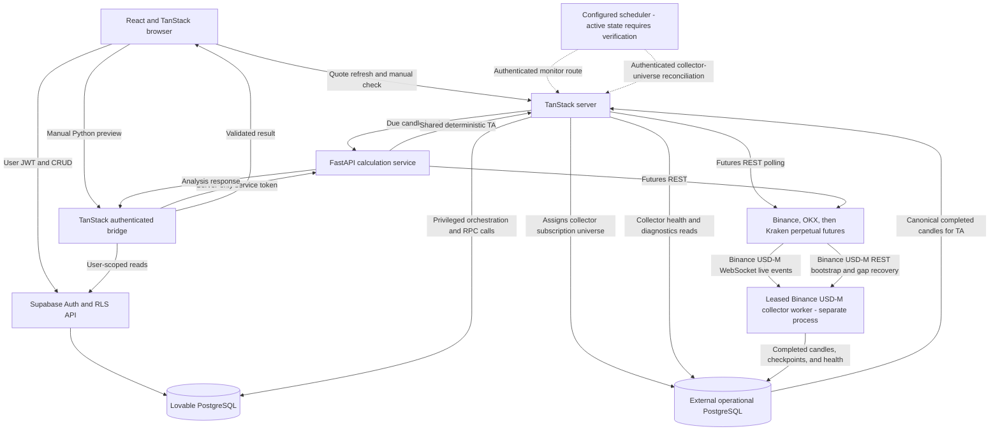
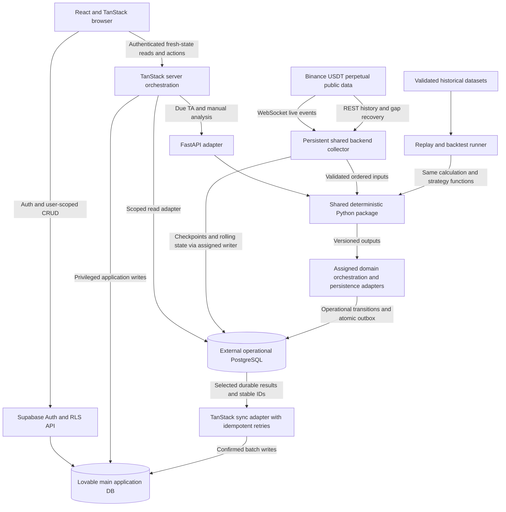

# Product direction and architecture

> **Provisional.** This document is AI-generated and is not the source of truth. The owner's
> intent in [`CLAUDE.md`](../CLAUDE.md) takes precedence. Reconciliation is tracked in
> [#181](https://github.com/ibrahimjaved12/crypto-watcher/issues/181).

## Owner intent (from CLAUDE.md section 2)

- **What the product is:** a personal crypto futures detection, prediction, logging and
  auto-trading **simulation** tool (Binance USDⓈ-M perpetuals, long and short). The
  owner uses it for their own trading. It should be buildable into a multi-user paid
  product later (account-scoped data), without paying for services or over-building
  until the tool proves it makes money.
- **Two modes:** (1) current assessment and alerts: something is happening in the
  market now; (2) forward trade predictions: "if X confirms, enter; exit by Y".
- **What "prediction" means:** a conditional trade path with entry condition,
  targets/resistance/support, stop, partial exits, invalidation and expiry. Level
  hits, next-candle or trend direction and pattern completions are all strategies
  and can be combined in one analysis.
- **Success:** a profitable trade after costs on the stop-aware path. Price eventually
  touching a target is not success if the stop (or liquidation) came first, and any
  metric that ignores the stop is misleading. Beware benchmarks any naive strategy
  would pass.
- **A score is a ranking,** not a win probability: 90/100 does not mean 90%.
- **Real-money execution stays manual for now.** That is not permanently excluded
  and not permanently required. The automated fake-money simulation with realistic
  futures costs is in scope and important.

Setup and outcome definitions follow the stop-aware benchmark: see
[analysis and evaluation](analysis-evaluation.md#setup-definition-the-benchmark-barrier-event).

Decision snapshot: 2026-09-20, implementing [issue #12](https://github.com/ibrahimjaved12/crypto-watcher/issues/12).
The [staged implementation and deployment roadmap](roadmap.md) separates current,
proposed, and conditional work. [Analysis records and evaluation](analysis-evaluation.md)
defines saved histories, evidence-bound setups, scoring, and strategy outcomes. The
[futures paper-trading simulator](futures-simulation.md) separately defines virtual
wallet automation, execution, costs, and account results. This document changes no
runtime behavior, secrets, schedules, or infrastructure. “Current” below describes
repository code, not proof that a deployed service or scheduled job is healthy.

## Product purpose and boundaries

Crypto Watch targets **conditional futures-trade opportunities and profitability
after costs**, initially for one user. The initial market is **Binance USDⓈ-M,
USDT-margined perpetual futures, both long and short**. Other contract types are
outside this initial scope.

A prediction means a time-bounded trade path derived from a specific assessment:
a setup forms, its required pattern and evidence remain valid, confirmation
activates it, an executable entry becomes available, management rules apply, and
the trade reaches a terminal state. Price levels are conditional on that premise;
touching an entry price cannot activate a setup when its required chart, volume,
movement, news/event, or other condition never occurred. Profitability must include
fees, spread, slippage, funding, execution latency, and capital constraints, with
assumptions visible.

Real-money decisions and execution stay manual **for now**; this is not a permanent
exclusion, and any change needs the owner's explicit decision. No real-money
order placement is planned at present. Planned paper trading can automatically
manage virtual positions; it requires no trading credentials or real order calls.
There is no promise of profit. Never invent missing prices, news, or certainty.

## Product lifecycle

These are separate capabilities; the table describes the intended product, not
features already delivered.

| Capability                        | Meaning and evidence                                                                                                                                                                                          |
| --------------------------------- | ------------------------------------------------------------------------------------------------------------------------------------------------------------------------------------------------------------- |
| Current assessment                | Explain current movement, technical patterns, volume, market breadth, news context, relevant levels, and freshness. It need not propose a trade.                                                              |
| Developing setup                  | Preserve direction, eligibility, entry zone, awaited confirmation, expiry, invalidation, and a versioned management/evaluation plan. It is not yet a position.                                                |
| Activation                        | Record the exact confirmation event/time and the next executable-entry rule and price. Activation does not guarantee a fill or available wallet capital.                                                      |
| Trade management                  | Follow fixed rules for stop-losses, partial take-profits, branching targets, fallback/time exits, invalidation, and liquidation. Track remaining quantity and terminal state.                                 |
| Evaluation                        | Grade the original setup and ordered trade path using only information/prices available then. Preserve untriggered, expired, invalidated, ambiguous, and unavailable outcomes as well as wins/losses.         |
| Historical replay and backtesting | Replay reconstructable inputs through the shared engine, then compare reproducible strategy/portfolio experiments with execution costs and chronological validation. A replay alone is not a wallet backtest. |
| Paper trading                     | Execute eligible setups against a virtual futures wallet. Apply fills, margin, capital/exposure limits, costs, and an auditable ledger; a valid setup may be rejected for insufficient capital.               |

Numeric levels, quantities, deadlines, trigger price types, and evaluation rules
must be stored as structured conditions, not inferred later from prose or chosen
after observing the result. Management transitions track the remaining position
quantity and the evidence or trigger responsible for each change. Short strategies
require equally explicit directional rules. No strategy is chosen here; the setup
definition is in [analysis and evaluation](analysis-evaluation.md#setup-definition-the-benchmark-barrier-event).

Technical, movement-driven, news-driven, and mixed strategies may have different
confirmation, expiry, management, and evaluation rules. Completed-candle TA is
separate from intrabar movement detection: waiting for a 4h candle close must not
be mistaken for the only way to detect rapid movement.

Outcomes (T/S/E/L/X, in R units net of costs) are specified in
[analysis and evaluation](analysis-evaluation.md#outcome-evaluation).

## News and event context

News and known scheduled events are part of the intended assessment. Store source
links, publication/event time, first-seen time, revisions, and retrieval freshness.
A calendar can show a known future announcement, not its unknown result. The system
does not claim to predict unknown future news or its market impact. Temporal
association with movement is not proof of causation.

AI may help deduplicate, classify, summarize, or explain attributed evidence. An
LLM response is not an original market source. Feed access depends on permitted
provider APIs and terms. Historical news strategies may use only content and
revisions demonstrably available at the simulated time; missing archives must be
excluded or labeled unavailable, not reconstructed from hindsight.

## Glossary and record boundaries

| Term                    | Meaning                                                                                                                                                 |
| ----------------------- | ------------------------------------------------------------------------------------------------------------------------------------------------------- |
| Observation             | A timestamped market measurement with source, contract, price type, and freshness; no trading claim is implied.                                         |
| Movement alert          | A threshold event under versioned movement/baseline and cooldown rules. It is not automatically a setup or entry.                                       |
| Current assessment      | A saved interpretation of available evidence about the market now.                                                                                      |
| Developing setup        | An immutable conditional opportunity and rule version awaiting activation, invalidation, or expiry.                                                     |
| Activated trade         | A setup whose confirmation occurred, with its activation evidence and executable-entry rule recorded. Actual simulated exposure requires a fill.        |
| Outcome                 | Later evidence evaluating the exact original setup/version and event path, including non-trades and ambiguity.                                          |
| Fill                    | A simulated executed quantity at a specified price, side, and time under a versioned execution model; an order intent or touched candle is not a fill.  |
| Simulation ledger entry | An append-only account event recording fills, fees, funding, margin changes, realized P&L, or liquidation, linked to setup, position, account, and run. |

Keep signal/assessment/setup records, evaluation outcomes, and the simulation ledger
**linked but distinct**. Later outcomes and wallet actions cannot overwrite the
original conclusion. A setup can be evaluated independently of whether a particular
wallet had enough capital to execute it. Existing `ta_signals` rows and their
forward-return fields are a legacy implementation, not this proposed record model.
The detailed record fields and separate activity, effectiveness, and wallet-history
views are specified in
[the intended record model](analysis-evaluation.md#intended-record-model-and-histories).

## Futures semantics and evidence contract

Every analytical record must preserve, as applicable:

- Stable ID and account scope; exchange, exact contract identity, market/contract
  type, base/quote/margin asset, direction, and timeframe. `BTCUSDT` alone cannot
  identify perpetual-futures contracts explicitly.
- Price value and **price type**: last/contract trade price, mark price, or index
  price. Last informs executable-price modeling; mark is used for the appropriate
  margin/liquidation checks; index is reference context, not an executable fill.
  Each stop/target explicitly selects its trigger reference.
- Source event time, observation/receive time, candle completion time, detection
  time, and persistence time in UTC. Dashboard refresh time is not data freshness.
- TA, strategy, scoring, configuration, and execution-model versions; total score
  and complete factor values, normalizations, weights, contributions, reasons, and
  disqualifiers. **90/100 is a ranking, not automatically a 90% win probability**;
  a probability claim requires separately versioned out-of-sample calibration.
- Reproducible inputs or immutable snapshot references/hashes, associated news IDs,
  and explicit stale, partial, missing, rejected, ambiguous, or unavailable states.

Apply funding at actual settlement timestamps and rates, using position notional
and the exchange sign convention at that instant. It is not an invented per-second
leverage borrowing charge; do not multiply an already calculated notional funding
payment by leverage again. Save applicable fee tiers, contract filters, tick/step
sizes, leverage/maintenance-margin brackets, and effective rule versions. Label
historical assumptions where the actual configuration cannot be reconstructed.

The initial wallet model is isolated-margin USDT perpetuals with configurable
leverage, long/short positions, partial fills/exits, and risk-at-stop sizing. Margin
is committed collateral, not an immediate expense. Track wallet/available balance,
margin, exposure, unrealized/realized P&L, costs, and equity separately. A high score
does not automatically increase leverage. Detailed exchange modeling is planned
in [#37](https://github.com/ibrahimjaved12/crypto-watcher/issues/37); the numeric
wallet example and accounting boundary are in
[virtual wallet and sizing](futures-simulation.md#virtual-wallet-and-sizing).

Evaluation consumes events chronologically. Use finer data when a candle cannot
prove whether entry, stop, target, or liquidation happened first; otherwise mark
ambiguity or apply a disclosed conservative policy. Never select the profitable
ordering silently. Replay uses only reconstructable point-in-time inputs, including
then-known news, instrument availability, rule versions, and data delays. Exclude
look-ahead, future candle values, and hindsight selection of surviving assets.
Report sample sizes, non-trades, ambiguity, net returns, drawdown, and cost sensitivity;
directional accuracy alone is not evidence of profitable trading.

## Current architecture and data flow

| Capability      | Current implementation                                                                                                                                                                                                                                                                                                                                                                                                                                                                                                                                                                                                                                                                                                                                                                                                            |
| --------------- | --------------------------------------------------------------------------------------------------------------------------------------------------------------------------------------------------------------------------------------------------------------------------------------------------------------------------------------------------------------------------------------------------------------------------------------------------------------------------------------------------------------------------------------------------------------------------------------------------------------------------------------------------------------------------------------------------------------------------------------------------------------------------------------------------------------------------------- |
| Browser         | React/TanStack dashboard; market quote and TA-history queries default to manual-only, including initial load, focus/reconnect, invalidation, and key-change fetches. Build-time flags can enable 60-second refetch intervals while active. Tabs and query lifecycle events can add requests when automatic fetching is enabled. See [activity controls](activity-controls.md).                                                                                                                                                                                                                                                                                                                                                                                                                                                    |
| Auth and CRUD   | Supabase Auth and user-JWT/RLS access through the browser or TanStack. Watchlists, settings, notes, and history live in Lovable PostgreSQL.                                                                                                                                                                                                                                                                                                                                                                                                                                                                                                                                                                                                                                                                                       |
| Monitoring      | TanStack scheduled route and authenticated manual check invoke the server monitor. Authenticated scheduled requests default to a skipped result before database access and require an explicit runtime flag to run; this does not disable manual checks or the external scheduler invocation itself. User controls independently gate REST collection/checkpointing, movement alerts, and completed-candle TA. TanStack holds privileged write access; PostgreSQL RPCs own ordered latest-candle checkpoints and atomic cumulative baselines, directional cooldowns, and alert insertion. See [independent activity controls](activity-domains.md).                                                                                                                                                                               |
| TA and outcomes | The shared Python package calculates completed 15m, 1h, and 4h TA. TanStack selects due work, validates responses, and is the sole `ta_signals` writer. While the collector owns market data, TanStack reads canonical completed candles from the operational store through a read-only adapter instead of fetching a second live exchange series, carrying each candle's recorded endpoint, transport, close time, exchange event time when one exists (absent for REST) and receive time into the Python request and the persisted conclusion; candle completion is the deterministic boundary `open + timeframe`; missing or stale history fails visibly. Failures are visible and have no alternate calculator. Outcome evaluation remains in TanStack and measures forward returns, not ordered futures-trade profitability. |
| Python service  | The authenticated FastAPI service provides pure manual, scheduled, and replay-compatible calculations. It has no application database credentials and performs no persistence.                                                                                                                                                                                                                                                                                                                                                                                                                                                                                                                                                                                                                                                    |
| Providers       | Futures trade-price REST polling in order: Binance USDⓈ-M, OKX USDT swaps, then Kraken perpetuals. A persistent shared Binance USDⓈ-M collector exists: it ingests public futures klines and aggTrades with REST bootstrap and gap recovery, and it runs as a separate backend worker rather than through TanStack application-server startup. The application assigns its shared subscription universe through the operational database, reconciled by a dedicated authenticated hook that is the initial and ongoing mechanism and a best-effort first-request safety pass, independent of scheduled monitoring, and the worker holds no Lovable credentials. Selecting its production host remains unresolved under [#19](https://github.com/ibrahimjaved12/crypto-watcher/issues/19).                                         |

The scheduler's configured intent is a five-minute monitor invocation. However,
[#13](https://github.com/ibrahimjaved12/crypto-watcher/issues/13) reports that
`crypto-watch-monitor-5min` was observed with `active = false`; historical executions
do not prove current operation. Live job state, other callers, and end-to-end success
remain to be verified there. This documentation neither enables nor changes a job.

Code evidence: [dashboard](../src/routes/_authenticated/dashboard.tsx),
[TA history](../src/components/market/technical-analysis.tsx),
[monitor engine](../src/lib/monitor/engine.server.ts),
[TA persistence](../src/lib/ta/engine.server.ts),
[collector worker](../src/lib/market/collector-worker.server.ts), and
[Python bridge](../src/lib/analysis.server.ts).

Both provider implementations try Binance USDⓈ-M, OKX USDT perpetual swaps, then
Kraken perpetual futures. Stored rows keep the selected Binance contract identity
and record the actual futures source and endpoint. The cutover deliberately deletes
the disposable pre-release market data.

Not yet implemented: external operational sync of durable results (the transactional
outbox is dormant), news ingestion, conditional setup state machines, ordered trade
outcomes, historical backtests, virtual wallets, continuous paper trading, calibrated
ML, or email/WhatsApp delivery.

## Proposed incremental architecture and data flow

Lovable PostgreSQL remains the main application database initially. Add external
PostgreSQL/Supabase for explicitly allocated frequent operational state and a
persistent backend process for public futures WebSocket collection. These are
planned changes, not deployed capabilities or a commitment to a fully external backend.

The diagram shows logical adapters, not a decision to give Python database
credentials. TanStack retains privileged Lovable writes. FastAPI exposes pure
calculations over HTTP; replay/backtest runners import the same Python package
without an HTTP round trip. Provider access, authorization, persistence, scheduling,
and notifications stay outside the deterministic core. Pass an explicit `as_of`,
validated inputs, and versions; no hidden wall clock, secrets, database connection,
or global scheduler state may change a calculation result.

A persistent backend collector runs independently of browser tabs. **A database
does not run the WebSocket process, and short-lived Edge Functions are not assumed
to be a permanent WebSocket host.** Select hosting using the bounded trial in
[#19](https://github.com/ibrahimjaved12/crypto-watcher/issues/19). One shared subscription
set serves consumers. REST supplies initial history and bounded reconnect/gap
recovery; deduplicate overlap at the live handoff, validate event ordering and candle
finality, and expose unrecoverable gaps. Checkpoint/batch bounded rolling state and
meaningful transitions rather than writing every raw tick. Browser delivery may
initially poll cached backend state independently of exchange stream latency.

## Service and database ownership

Each state domain has **one authoritative owner/writer**. The proposed allocation
below guides [#25](https://github.com/ibrahimjaved12/crypto-watcher/issues/25); exact
tables, credentials, adapters, and cutover boundaries must be finalized there before
migration. No two databases accept competing writes to the same logical state.

| Domain                                                                  | Current authority/writer                                                                                    | Proposed authority/writer and storage                                                                                                                                                               |
| ----------------------------------------------------------------------- | ----------------------------------------------------------------------------------------------------------- | --------------------------------------------------------------------------------------------------------------------------------------------------------------------------------------------------- |
| Browser behavior                                                        | React/TanStack                                                                                              | React/TanStack remains responsible for UI, requests, and freshness display.                                                                                                                         |
| Identity and user CRUD                                                  | Supabase Auth; browser/TanStack user JWT and RLS; Lovable DB                                                | Retain this boundary and Lovable ownership of watchlists/settings/notes unless explicitly migrated.                                                                                                 |
| Privileged application orchestration                                    | TanStack server                                                                                             | TanStack retains authorization, due-work orchestration, response validation, and privileged Lovable writes.                                                                                         |
| Movement baseline/cooldown/alert transaction                            | Lovable PostgreSQL RPC invoked by TanStack                                                                  | Retain current authority until explicitly transferred; any move transfers the whole atomic state domain with one writer.                                                                            |
| TA calculations                                                         | Shared Python package; TanStack validates and writes scheduled results to Lovable                           | Retain this split unless operational evidence supports a broader orchestration migration.                                                                                                           |
| Collector checkpoints, rolling prices/candles, gap and due-work cursors | Lease-elected shared Binance collector worker; external operational DB for candles, checkpoints, and health | Assigned collector/orchestration persistence adapter is sole writer to external operational tables.                                                                                                 |
| Developing/active setup state and paper positions                       | Not implemented                                                                                             | One designated setup engine/simulation controller per state domain; external operational DB is proposed. Wallet, fills, and ledger transitions must commit atomically.                              |
| Immutable conclusions, outcomes, reports                                | Current TA/alerts in Lovable via TanStack                                                                   | Existing records retain their authority. For selected newly external-owned result domains, source commits result plus outbox; Lovable holds a read projection/history copy, not a second authority. |
| Sync outbox and receipts                                                | Not implemented                                                                                             | Source transaction owns external outbox; TanStack sync adapter alone writes selected Lovable projections/receipts and acknowledges delivery.                                                        |
| Historical research data                                                | No replay dataset store                                                                                     | Validated bulk files/archive outside small operational DBs; dataset manifests and checksums under a designated ingestion owner.                                                                     |
| Notification delivery                                                   | Not implemented                                                                                             | A dedicated delivery adapter owns each outbox delivery state; channel failures never discard domain evidence.                                                                                       |

Synchronization generates stable globally unique IDs at the authoritative source.
Commit a durable result and pending outbox entry together. Batch only selected
conclusions, meaningful transitions, completed outcomes, and summaries into Lovable
with duplicate-safe keys including immutable version. Acknowledge after destination
confirmation; retry uncertain outcomes with bounded backoff, retain dead letters,
and define ordering for superseding versions. Daily archival sync is insufficient
for active setups: TanStack must offer authenticated, account-scoped fresh external
reads with credentials remaining server-side. Bound retention and verify archives
and restore before deletion; moving updates does not by itself prove cost savings.

Cutovers require one active writer, leases where needed, uniqueness/idempotency,
restart recovery, reconciliation, and rollback. Old catch-up events cannot appear
as fresh trade notifications. Preserve unavailable/failure states rather than
silently using a second calculator or stale inputs.

## Decisions and deployment gates

- **Current:** React/TanStack, Supabase auth/CRUD, TanStack privileged Lovable writes,
  ordered futures REST monitoring, and canonical Python TA calculations.
- **Proposed:** external operational PostgreSQL with selective sync; persistent public futures
  collector with REST recovery; evidence-backed setups, evaluation, and paper trading.
- **Conditional:** Django/ORM ownership, Celery/broker, direct Python database access,
  broader Python orchestration, a fully external backend, and paid hosting. Decide
  from measured uptime, latency, query/write volume, CPU/memory, bandwidth, storage,
  monthly cost, recovery needs, and maintenance burden in
  [#41](https://github.com/ibrahimjaved12/crypto-watcher/issues/41).

Django is useful only if schema/transaction/admin ownership warrants migration.
Celery or another queue needs a demonstrated durable retry/concurrency requirement.
A larger migration must account for auth/session mapping, schema, jobs, storage,
secrets, notifications, backups, reconciliation, one-writer cutover, and rollback.
Changing framework alone is not a reason to move ownership.

See the [roadmap](roadmap.md) for ordered dependencies, deployment gates, and dated
provider references. Existing [TA](technical-analysis.md),
[cumulative monitoring](cumulative-monitoring.md), and [Python API](python-api.md)
notes describe current implementations; they do not establish futures readiness.
